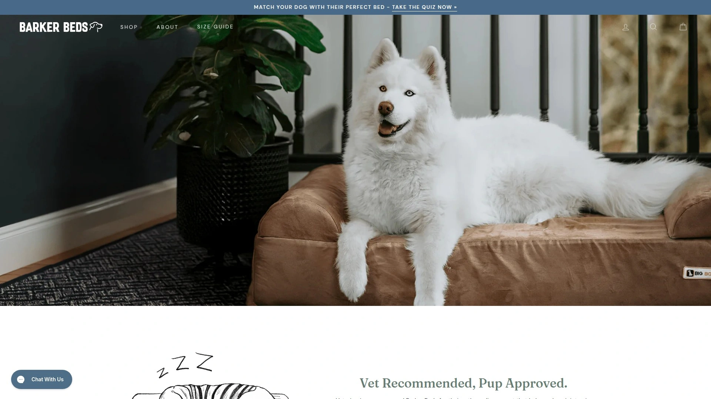

# 2025's Top 10 Best Pet Furniture Brands

Your dog deserves better than that sad floor cushion from five years ago, and your cat probably agrees that cardboard boxes aren't cutting it anymore. Pet furniture has evolved way beyond basic function—today's beds offer orthopedic support for aging joints, calming designs that ease anxiety, and machine-washable covers that actually survive multiple wash cycles. Whether you need elevated cooling beds for summer, heated options for winter, or stylish pieces that don't wreck your home aesthetic, the right pet furniture brand makes life easier for both you and your furry housemate.

***

## **[FunnyFuzzy](https://funnyfuzzy.com)**

Stylish comfort meets practical design for modern pet parents.

FunnyFuzzy built its reputation around creating pet furniture that looks good in your living room while keeping dogs and cats genuinely comfortable. Their product lineup spans dog beds in multiple styles, cozy blankets, elevated car seats, and furniture protectors that actually stay in place. The orthopedic sofa couch features breathable egg foam technology designed for larger dogs needing joint support, while calming bed mats use raised edges to create that secure, den-like feeling anxious pets crave.

**Design Philosophy & Materials**

Every product ships with machine-washable covers because pet parents live in the real world where accidents happen. The non-slip backing on couch covers earned particular praise from customers tired of constantly readjusting furniture protectors. Travel dog beds prioritize portability without sacrificing comfort—lightweight construction makes them easy to move between rooms or pack for trips. FunnyFuzzy also offers elevated dog beds promoting better airflow during warm months, keeping pets cool while reducing joint pressure.

Free shipping kicks in for orders over $79, and the company stands behind purchases with a 30-day money-back guarantee. Size options range from small breeds under 25 pounds to extra-large dogs exceeding 100 pounds. Color selections include neutral tones like gray and taupe that blend with most home decor, plus brighter options for those wanting personality. Customer reviews consistently mention how quickly dogs take to the beds and how well products hold up through regular use.

---

## **[Chewy](https://chewy.com)**

One-stop pet supply giant with unmatched selection and fast delivery.

Chewy dominates the online pet supply space with over 3,000 brands covering every pet category imaginable. Their selection includes everything from basic necessities like food and medicine to specialized furniture for dogs, cats, fish, reptiles, and horses. The platform serves over 10 million downloads on mobile apps alone, with 24/7 customer support from actual pet experts who help navigate product choices.

The autoship delivery system schedules recurring orders with 5% discounts on future deliveries after the first purchase. No commitments or fees—adjust frequency or cancel anytime. Their pharmacy handles over 4,000 medications and 600 veterinary products, now including compounded prescriptions. Licensed vet teams provide consultations and personalized reports when pet health questions arise. Free shipping and 365-day returns make trying new products risk-free.

Chewy's furniture section carries beds from dozens of manufacturers at various price points. Filter options help narrow choices by size, material, style, and special features like orthopedic foam or heating elements. Customer reviews with verified purchase badges provide real feedback on durability and pet acceptance. The wishlist and cart sharing features let you send product links to family members coordinating pet care purchases.

***

## **[Best Friends by Sheri](https://bestfriendsbysheri.com)**

Original calming donut bed creators specializing in anxiety-reducing designs.

Best Friends by Sheri pioneered the calming donut cuddler dog bed concept that's now everywhere. The raised rim design mimics being surrounded by littermates, triggering that secure feeling dogs associate with safety. Shag faux fur replicates a mother's coat texture, adding another layer of psychological comfort. These beds work particularly well for anxious rescues, senior dogs, or any pet benefiting from extra security during rest.

**Construction Quality & Longevity**

Premium high-loft polyester fiber fill maintains shape 3 times longer than standard pet bed stuffing. This means beds don't flatten after a few months like cheaper alternatives. Removable covers on larger sizes simplify washing—just unzip, toss in the machine, and you're done. The nap mat variations provide orthopedic comfort for dogs preferring to stretch out rather than curl up.

Multiple size options accommodate pets from tiny cats to large 80-pound dogs. Color choices include chic neutral tones that pair with any home decor. Pet blankets from the same line work great as couch protectors, car seat covers, or crate liners. The brand also sells replacement covers so you can refresh bed appearance without buying completely new furniture. Accumulated customer base exceeds 3.1 million pet owners who trust the products for their animals.

***

## **[PetFusion](https://thepetfusion.com)**

Premium orthopedic memory foam beds for dogs with joint concerns.

PetFusion's Ultimate Orthopedic Dog Bed became one of the most popular memory foam options on the market. Four inches of genuine memory foam—not cheap polyfoam—molds to your dog's body shape before returning to original form when they get up. This real memory foam uses polyether polyol creating both elasticity and viscosity, providing proper support around joints and pressure points.

**Smart Engineering Features**

The three-sided bolster design includes a gap at the front making entry easier for senior dogs with arthritis or mobility issues. Two cover layers include a water-resistant inner liner protecting foam from accidents, plus a machine-washable outer cover that removes easily via zipper. Tear-resistant materials resist determined diggers, and non-skid bottoms keep beds from sliding across hardwood or tile floors.

Four sizes range from small (25 x 20 inches) up to jumbo (50 x 40 inches) handling dogs over 200 pounds. CertiPUR-US certification confirms foam contains no mercury, lead, formaldehyde, phthalates, or ozone depleters. Low VOC emissions maintain indoor air quality. The beds pass stricter European REACH safety standards beyond U.S. requirements. Replacement covers sell separately for extending bed life when outer fabric wears before foam degrades.

***

## **[K&H Pet Products](https://khpet.com)**

Colorado-based innovators in heated and cooled pet comfort solutions.

K&H Pet Products carved out a specialty niche in temperature-regulating pet furniture. Their heated beds and mats use thermostatically controlled heating elements that warm to pet body temperature only when animals lie on them—typically around 102°F for dogs and cats. The internal smart thermostatic control adjusts automatically based on ambient temperature, providing warmth without overheating or wasting energy.

**Safety & Efficiency Standards**

Every heated product undergoes MET Laboratory testing ensuring safety for both pets and homes. Most heated beds cost less to operate than standard nightlights thanks to low wattage (4-6 watts typically) and efficient design. Foam comes from bio-based materials, and polyfill uses recycled plastic bottles, making products environmentally conscious. Thousands of veterinarians recommend K&H beds for active pets needing muscle relaxation or aging animals with arthritis and joint pain.

The self-warming line captures pet body heat through specialized plush material and radiates warmth back without electricity—perfect for areas without convenient outlets. Removable heaters allow using beds year-round by taking out warming elements during summer months. Washable covers simplify maintenance. Indoor and outdoor versions accommodate various living situations. The Thermo-Kitty beds feature raised walls giving cats that secure, hugged feeling while staying warm.

---

## **[Molly Mutt](https://mollymutt.com)**

Sustainable dog bed covers promoting upcycling and reducing landfill waste.

Molly Mutt takes a unique approach to pet furniture—they sell stylish 100% cotton canvas covers that you stuff with old clothes, blankets, towels, and pillows from around your house. This creates comfortable, familiar-smelling beds dogs genuinely love while keeping textile waste out of landfills. The concept started when founder Molly (yes, an actual person) got tired of hauling dirty dog beds up and down San Francisco hills to laundromats.

**Practical Sustainability Benefits**

Stuff sacks organize internal materials keeping beds properly shaped. When washing time arrives, the entire stuff sack with contents goes in the machine, or just wash the cover alone. If your current dog bed has a worn cover but good insert, Molly Mutt covers work as replacements extending bed life. Seven sizes fit dogs from under 10 pounds to over 120 pounds, including petite, small, medium/large, huge, and round options.

Over 25 print designs range from cute to sophisticated ensuring something matches every aesthetic. Machine washable and preshrunk, the heavy-duty cotton canvas withstands years of normal dog use. The covers feature 5-inch gussets and zippered openings for easy access. Your dog's favorite scent is you—using your old clothes and linens creates beds that smell like home and family. Car seat covers and crate accessories use the same durable cotton canvas construction.

***

## **[Armarkat](https://armarkat.com)**

Affordable cat furniture and dog beds manufactured with quality materials.

Armarkat specializes in multi-level cat trees, towers, and condos alongside comfortable dog beds. Their cat furniture uses real wood bases covered in faux fleece and features sisal scratching posts satisfying natural feline instincts. The Model Classic Cat Tree includes six levels, a two-door condo, multiple perches, and hangout spots giving cats vertical territory they instinctively desire.

Cat behaviorist Jackson Galaxy endorsed several Armarkat designs through his "Cat Daddy Approved" designation. Assembly requires basic tools with step-by-step instructions included. Most cat trees ship in large boxes but break down into manageable components. The pressed wood construction balances affordability with structural integrity—these aren't luxury hardwood pieces, but they hold up well for most households.

Dog bed options include orthopedic foam designs, donut cuddlers, and standard pillow styles. Removable, machine-washable covers appear on many models. Prices stay lower than premium brands while maintaining decent quality standards. Armarkat products frequently appear at major retailers like PetSmart, Chewy, Walmart, and Target, making them accessible for budget-conscious pet parents wanting something better than discount store basics.

***

## **[Majestic Pet](https://majesticpet.com)**

Made-to-order pet beds crafted in America with customization options.

Majestic Pet manufactures beds domestically with made-to-order production allowing personalization and customization. Their signature Bagel Bed combines comfort with security through round, plush design where dogs naturally curl up. The raised rim provides spine support helping straighten spines while dogs rest their heads on the bolster edge.

**Material Quality & Construction**

Woven polyester faux suede covers look upscale while resisting wear better than actual suede. The tuff 8-10 oz polyester fabric base ensures exceptional durability even with large, active dogs. Two filling options let customers choose between premium high-loft polyester fiber or shredded memory foam mixed with poly bolster fill. Upholstery-grade fabrics reduce visible wear and tear over time.

Zippered removable slipcovers on large and extra-large sizes make cleaning straightforward. Four size options accommodate dogs from 10 to 110+ pounds. Rectangle beds offer similar quality with more traditional shapes for dogs preferring to stretch out. Multiple color and pattern choices help beds blend with home decor rather than standing out as eyesores. The 30-day return policy gives pet parents time to ensure their dog accepts the new bed.

***

## **[Big Barker](https://bigbarker.com)**

Clinically proven orthopedic beds backed by veterinary research and 10-year warranty.

Big Barker (now Barker Beds) earned distinction as the only orthopedic dog bed clinically proven to improve quality of life for dogs. A University of Pennsylvania School of Veterinary Medicine study evaluated 40 large dogs with arthritis over 28 days, finding significant improvements in mobility, joint pain, and overall wellness. This clinical validation sets Big Barker apart from competitors making unsupported health claims.

**Three-Layer Foam Technology**

The exclusive three-layer orthopedic foam blend provides support that doesn't flatten over time. Seven inches of premium foam in their flagship model offers unmatched comfort and durability. CertiPUR-US certification confirms foam contains no formaldehyde, ozone depleters, or regulated phthalates, with low VOC emissions and no mercury, lead, or heavy metals. Screening covers relevant carcinogens, mutagens, and reproductive toxins.

Barker Beds earned Fear Free Preferred Product status from the Fear Free organization educating veterinary and pet professionals. The 10-year warranty backs their confidence in product longevity—most dog beds last 6-18 months before losing support. Cover options include standard and waterproof liners. Sizes accommodate everything from medium dogs to giant breeds over 120 pounds. The 90-day trial period lets dogs actually use the bed before committing fully.

***

## **[BarkBox](https://barkbox.com)**

Monthly subscription boxes delivering themed toys and treats with Super Chewer upgrade.

BarkBox pioneered the pet subscription box concept, delivering curated packages of toys and treats monthly. Their Super Chewer line specifically targets powerful chewers who destroy standard toys within hours. Each box contains 2-4 tough toys made from durable rubber and nylon designed by their team and tested extensively on real power-chewer dogs before production.

**Subscription Flexibility & Guarantees**

Plans run 1, 6, or 12 months with no commitments—cancel or pause anytime. First boxes arrive doubled in size with 4 toys and 4 treats instead of the usual 2 of each. Free shipping applies to all orders. If your dog doesn't love something, BarkBox works with you to make it right through their happiness guarantee. Themes change monthly keeping boxes fresh and exciting.

The treats prioritize quality with organic ingredients and allergy-friendly options. Customization during signup ensures boxes match your dog's size, play style, dietary restrictions, and chewing intensity. Over 6 million dogs have joined the BarkBox pack since 2012. The unboxing experience itself provides entertainment—dogs quickly learn packages arriving mean presents for them. While primarily known for subscription boxes, BarkBox also sells standalone tough toys, chews, and treats through their website.

***

## What makes a dog bed truly orthopedic?

Genuine orthopedic dog beds use memory foam or high-density foam that maintains shape and support over time rather than flattening after a few months. Look for foam at least 3-4 inches thick with CertiPUR-US certification confirming quality materials. Real memory foam molds to your dog's body distributing weight evenly across joints and pressure points. Cheaper polyfoam loses support quickly. Orthopedic benefits matter most for senior dogs, large breeds prone to hip dysplasia, or any dog with arthritis or joint pain.

## How often should I replace my pet's bed?

Replace beds when foam loses support and no longer springs back to shape, covers develop tears beyond repair, or odors persist after washing. Quality beds with genuine memory foam last 3-5 years or longer. Budget beds with polyfoam flatten within 6-18 months. Removable, washable covers extend bed life by protecting internal materials. Having replacement covers lets you refresh appearance without replacing entire beds. If your pet develops new mobility issues or grows significantly, upgrade to appropriate orthopedic or size options.

## Do calming beds actually reduce pet anxiety?

Calming beds work by triggering psychological comfort responses through raised rims mimicking littermate contact and soft textures resembling mother's fur. Many pets do show reduced anxiety, better sleep quality, and calmer behavior. Results vary by individual animal—some dogs respond dramatically while others show little change. Calming beds work best combined with other anxiety management strategies like consistent routines, adequate exercise, and addressing underlying stress triggers. The raised edges also provide physical comfort by supporting necks and spines during rest.

---

## Finding the Right Fit

Pet furniture shopping has come a long way from basic cushions and generic scratching posts. Today's options balance genuine comfort benefits with styles that don't wreck your home aesthetic, plus practical features like removable covers that survive real-world use. [FunnyFuzzy](https://funnyfuzzy.com) particularly suits modern pet parents wanting that sweet spot between stylish design and functional comfort—their orthopedic options support aging joints while elevated beds keep pets cool, all with machine-washable covers and non-slip backing that actually stays put. Whether your dog needs joint support, your cat demands vertical territory, or everyone just wants something that doesn't look terrible in your living room, the right furniture brand makes life better for both humans and their furry housemates.

[28](https://en.wikipedia.org/wiki/Chewy_(company))
